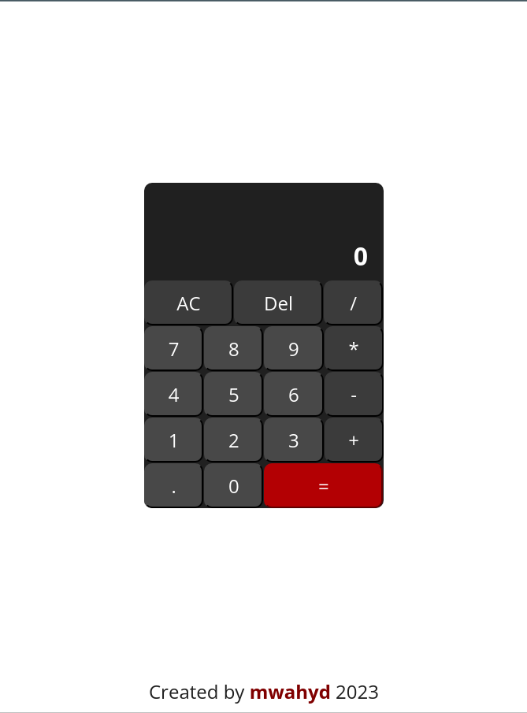
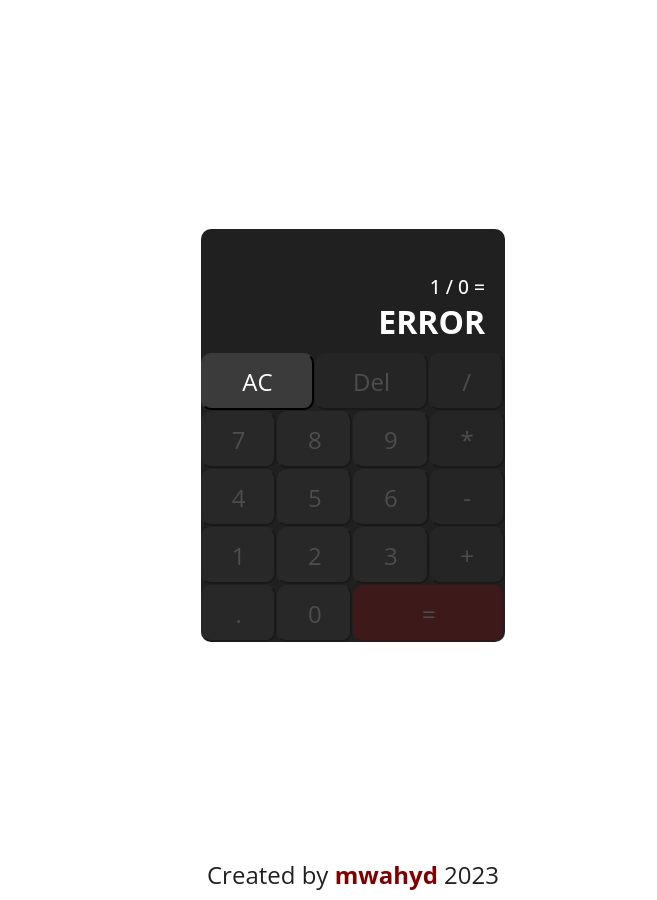

# Web Calculator App

[Live demo](https://mwahyd.github.io/TOP-projects/05-calc/index-calc.html)

App Functionalities:

- Perform basic arithmetic functions
- Display the correct sequence of numbers and signs as pressed
- Able to chain expressions and display the result (eg: 12 + 7 - 5 \* 3 = 42)
- Round answers to an appropriate significant figure
- Truncate extremely long numbers to exponent form
- Able to clear the calculator and start over
- Able to delete numbers from calculator if required
- Catch math errors and require calculator to be resetted

Tools:

- HTML
- CSS
- Javascript

Features to Add:

- Keyboard support

