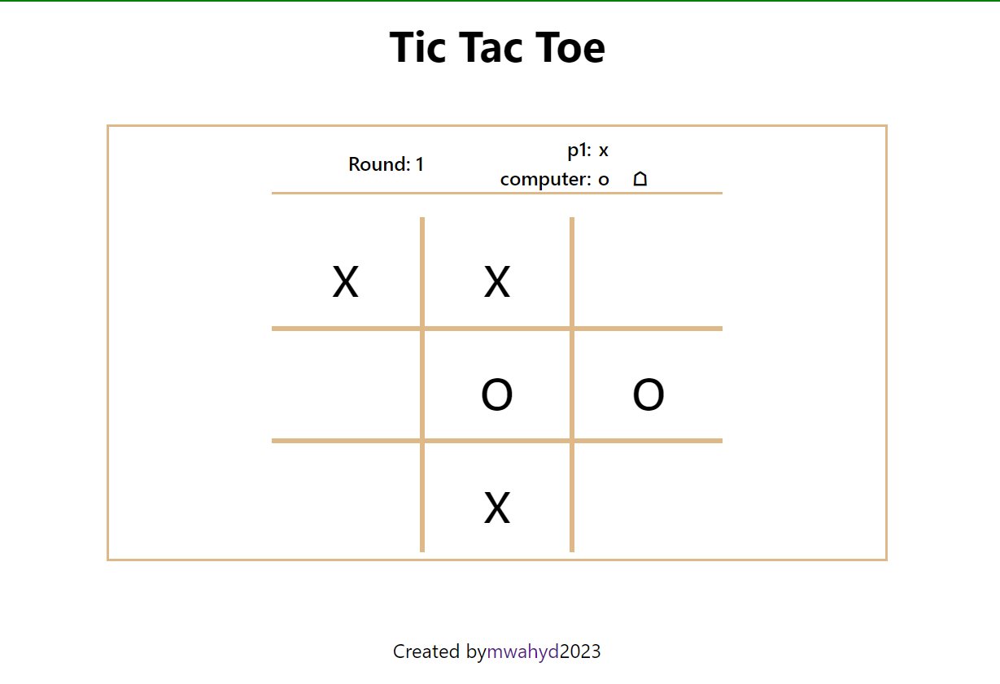

# Project: Tic Tac Toe

[Live demo](https://mwahyd.github.io/TOP-projects/09-tic-tac-toe/menu.html)

The project is an attempt to get a deeper understanding of proper programming design philosophies in JavaScript.

App Functionalities:

- play agaisnt an opponent
- when 3 in a row, winner declared
- score kept
- players can choose a marker and set custom name

Features to add:

- fix "Computer as opponent" code in source
- add media queries to fix game in large displays

