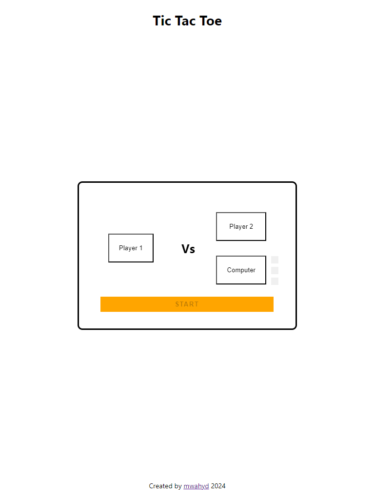
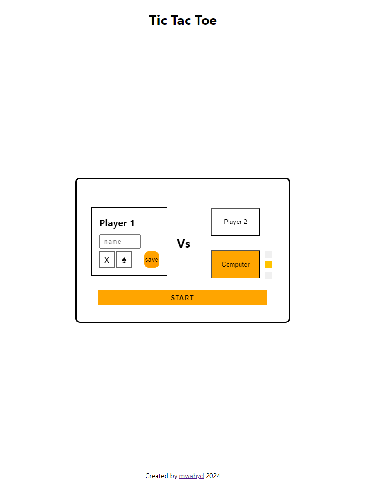
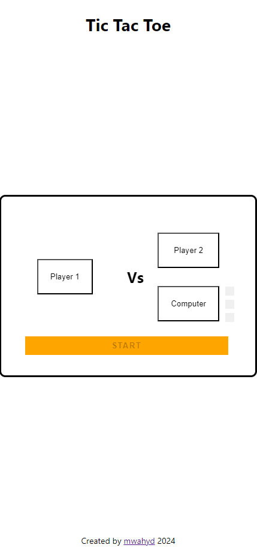
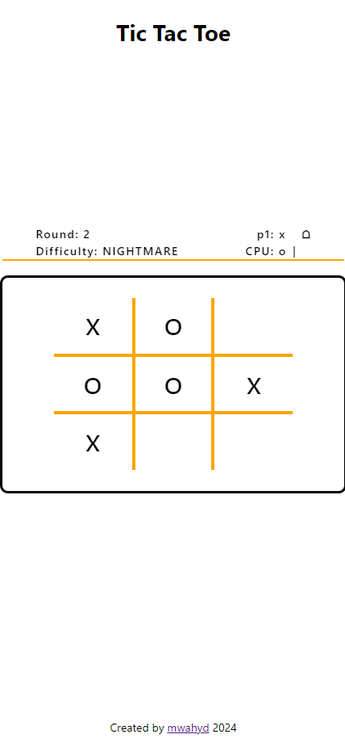

# Project: Tic Tac Toe Web App

[Live demo](https://mwahyd.github.io/TOP-projects/091-tic-tac-toe/index)

## **Description**:

The goal of the project is to recreate the game Tic-Tac-Toe as a web app.
Utilising modular patterns to create simplified and readable code.

## **Features**:

- play against CPU or a human P2 player
- 3 CPU difficulties with an unbeatable mode
- players can choose a marker and set custom names
- click "SAVE" in P1 and/or P2 forms to QUICK start
- view score
- great user interface

## **Preview**

|                        Desktop                         |                         Desktop                         |
| :----------------------------------------------------: | :-----------------------------------------------------: |
|  |  |

|                        Mobile                        |                        Mobile                         |
| :--------------------------------------------------: | :---------------------------------------------------: |
|  |  |
