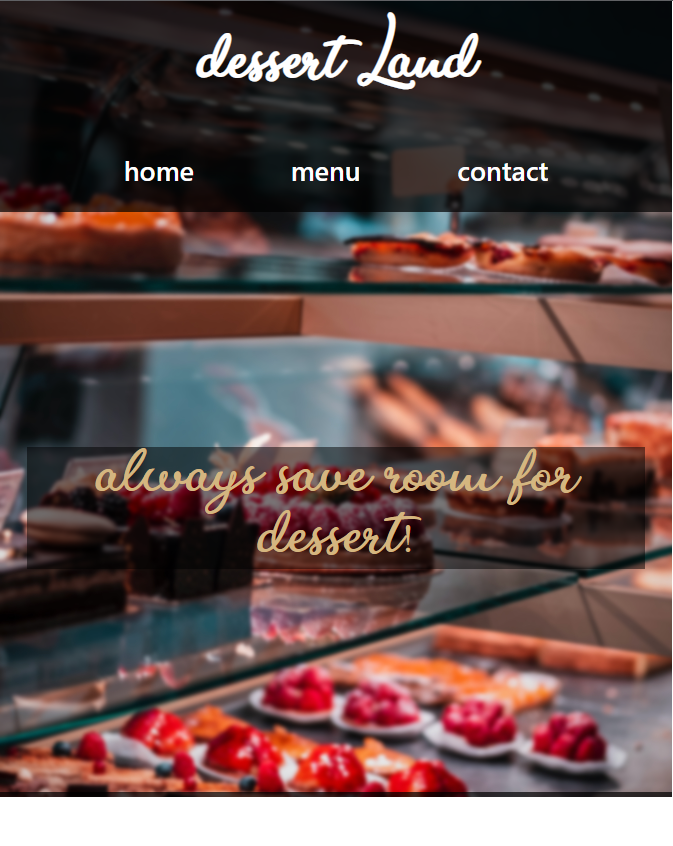
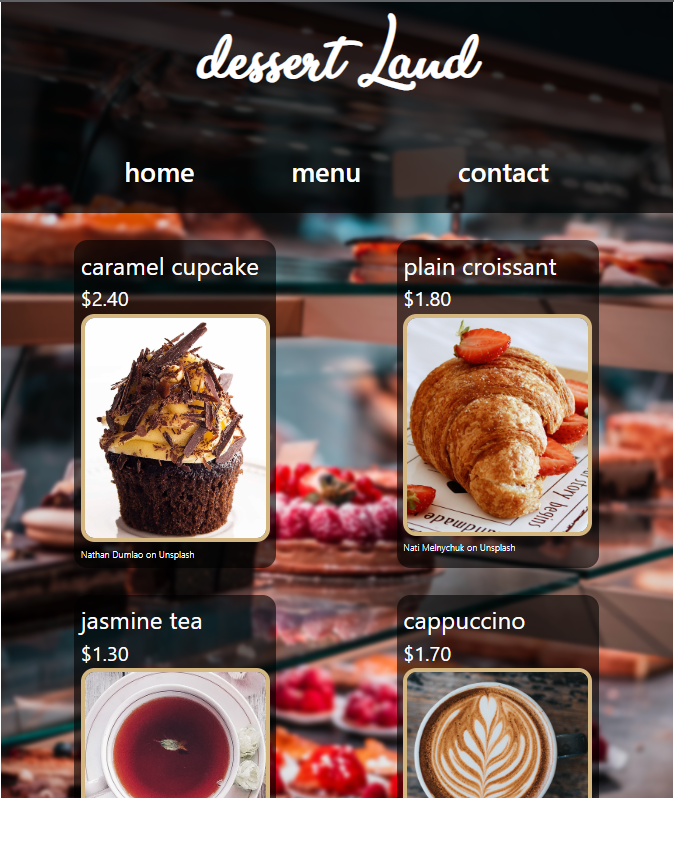
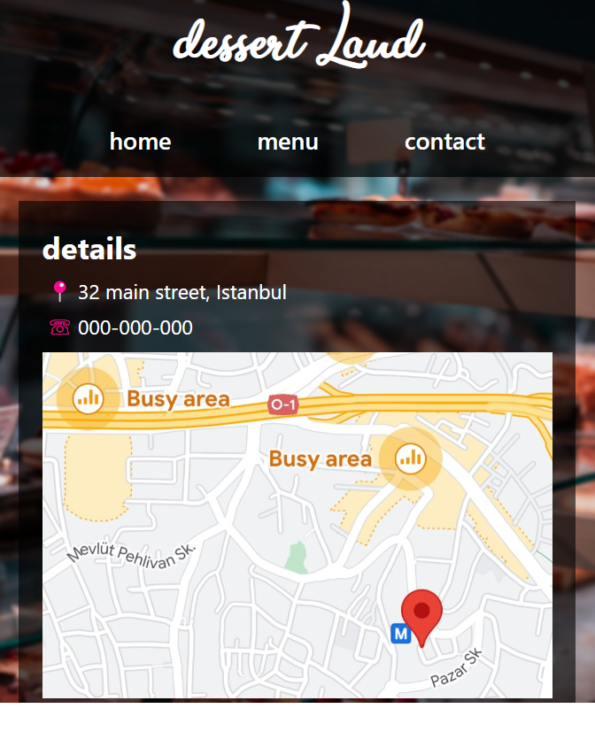

# Project: Restaurant Page

[Live demo](https://github.com/mwahyd/TOP-projects/blob/main/10-restaurant-page/dist/index.html)

This is a Webpack based project.
The goal was to familiarise using a module bundler, install various different plugins and loaders to enable the usage of different types of files.

Learned outcomes:

- dynamically create the HTML file using the html-webpack-plugin
- the use of ES6: modules (import / export)
- splitting code into different files

